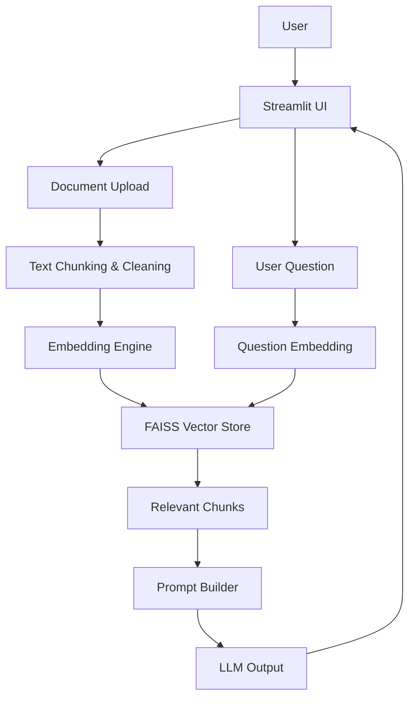
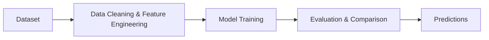
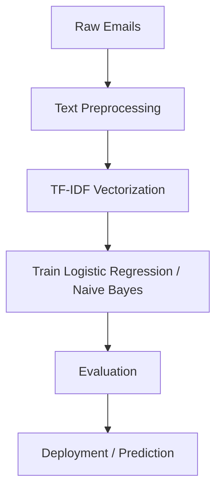
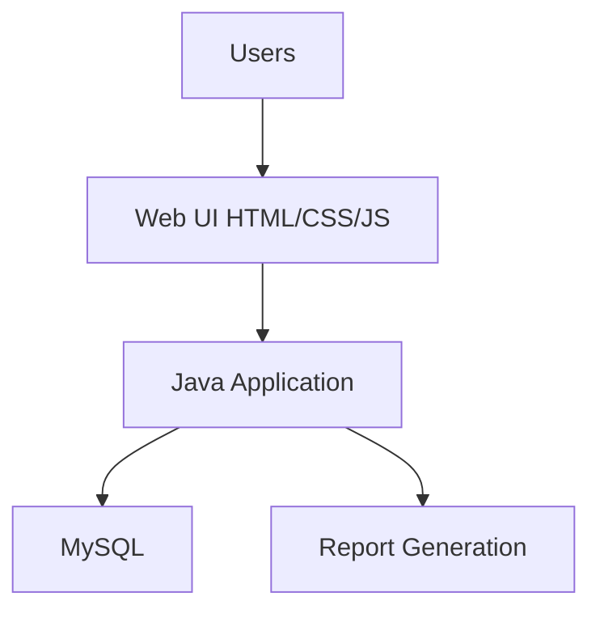

# 👋 Hi, I'm Abhishek Tomar

  

  
  
  
  

---

## 💡 About Me
I'm a **Full-Stack Software Engineer** and **AI/ML enthusiast**. I build **secure, scalable, and intelligent systems**, blending **backend performance** with **user-friendly interfaces** and advanced AI capabilities.  

> "Strong engineers are built through discipline, depth, and deliberate practice."  

I specialize in turning **complex problems into clean, high-performance, and intuitive solutions**.

---

## 🛠️ Tech Stack

   
  
  
  
  
  
  
  
  
  

---

## 📊 Coding Profiles

  
  

---

## 📂 Projects

  

### 1️⃣ AI Document Question Answering Chatbot
**Python | RAG | NLP | Transformers**  

📖 An AI chatbot that answers questions **directly from uploaded documents** using **Retrieval-Augmented Generation (RAG)**.  

  

- **Tech Used:** Hugging Face Transformers, PyTorch, FAISS, LangChain, Streamlit  
- **Features:** PDF/text upload, semantic search, vector embeddings, context-aware answers  

**Workflow & System Design:**  

**Repository:** [GitHub](https://github.com/Abhishek-09-Tomar/ai-document-chatbot)

---

### 2️⃣ Evergreen Estate – Real Estate Price Prediction

**Machine Learning | Regression | Real Estate**

Predicts house prices based on historical housing data.

  

**Workflow Diagram:**

[Source Code](https://github.com/Abhishek-09-Tomar/real-estate-price-prediction)

---

### 3️⃣ Spam Mail Detection – Email Classifier

**Python | NLP | Naive Bayes**

  

Classifies spam emails accurately using NLP and ML pipelines.

**Workflow Diagram:**

[Source Code](https://github.com/Abhishek-09-Tomar/Data-Science-with-AI-and-ML)

---

### 4️⃣ Library Management System using Java

**Java | Maven | MySQL | Web**

  

Full-stack system with user login, book/member management, and reports.

**System Design:**

[Source Code](https://github.com/Abhishek-09-Tomar/Library-Mangement-System-Using-Java)

---

### 5️⃣ Fake News Detection – NLP & ML Classifier

**NLP | ML | Classification**

Detects fake news using LIAR dataset and ML classification techniques.

  

[Source Code](https://github.com/Abhishek-09-Tomar/Data-Science-with-AI-and-ML)

---

## 🌟 Achievements & Internships

* **Ethical Hacking Intern**, EduSkills Foundation – Pen Testing & Vulnerability Assessment
* **Data Science Intern**, InternsElite (IIT Hyderabad) – Built ML models with 90%+ accuracy
* **B.Tech**, Galgotias University – Full-stack & system-level project experience

---

## 📈 Contribution Graph

---

## 💌 Hire Me / Freelance

  
  

---

  <i>Creating digital experiences that matter — one line of code at a time.</i>

